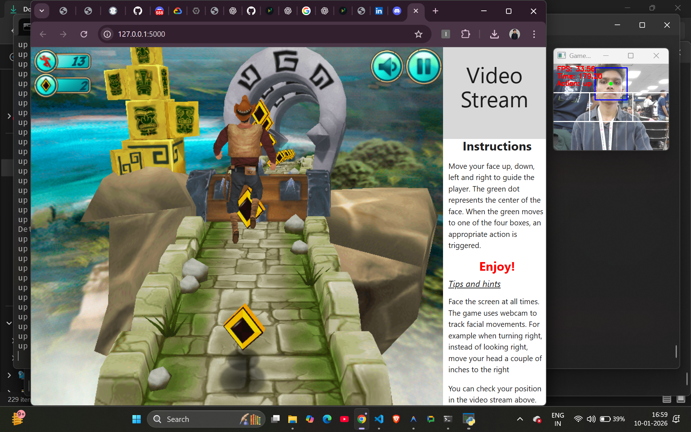
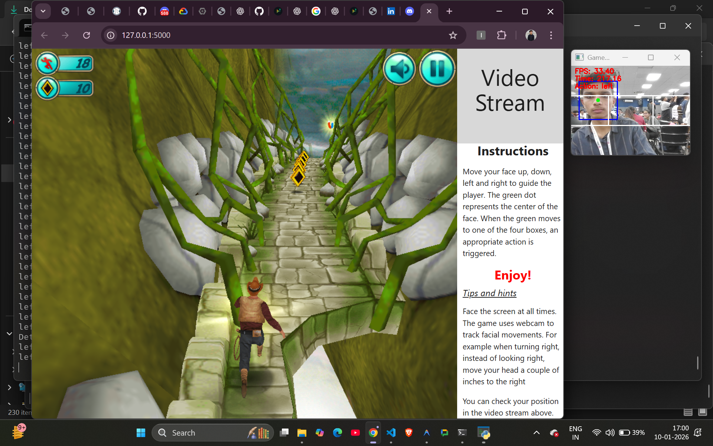

# Autonomous Fitness Gaming Platform

## Gameplay Screenshots

Real gameplay footage - exercising while playing:

*AI pose detection tracking exercises in real-time*

*Boss battle with live movement tracking*

---

## 🛠️ Tech Stack

Our platform leverages cutting-edge technologies across AI, computer vision, and web development to deliver a seamless fitness gaming experience.

### 🤖 AI & Machine Learning Frameworks

#### **LangGraph**
- **Purpose:** Orchestrates autonomous agent workflows and decision-making
- **Used In:** Personal Fitness Agent coordination, multi-agent communication system
- **Function:** Manages the autonomous decision flow between different specialized agents (Health & Safety, Motivation, Competition agents)

#### **Gemini**
- **Purpose:** Advanced AI model for natural language understanding and intelligent recommendations
- **Used In:** Nutrition & Recovery Agent, personalized workout suggestions, habit analysis
- **Function:** Generates contextual fitness advice, analyzes user behavior patterns, creates adaptive game packs

#### **Groq**
- **Purpose:** Ultra-fast LLM inference for real-time AI responses
- **Used In:** Real-time game adaptation, instant safety decisions, quick motivation nudges
- **Function:** Processes health signals and provides instant gameplay modifications

---

### 👁️ Computer Vision

#### **OpenCV (cv2)**
- **Purpose:** Real-time video processing and pose detection
- **Used In:** 
  - `backend/activity_api.py` - Face tracking and movement detection
  - `activity-detection2/app.py` - Advanced exercise detection
  - All game modules for camera-based control
- **Function:** Captures video frames, detects face position, tracks body movements, maps physical actions to game controls

#### **Haar Cascade Classifiers**
- **Purpose:** Face detection algorithms
- **Used In:** `backend/activity_api.py` - Initial face detection before tracking
- **Function:** Quickly identifies face regions for efficient tracking

---

### 🎮 Gaming & APIs

#### **Free Gaming APIs**
- **Purpose:** Provides game mechanics, leaderboards, and tournament data
- **Used In:** Subway Surfers integration, Temple Run mechanics, scoring systems
- **Function:** Fetches game assets, manages game states, handles multiplayer competitions

---

### 💻 Frontend Technologies

#### **React**
- **Purpose:** Interactive user interface and component management
- **Used In:** Main web application, dashboard, game selection interface
- **Function:** Renders dynamic UI, manages state, handles user interactions, displays real-time feedback

#### **Vanilla JavaScript**
- **Purpose:** Camera access and real-time frame processing
- **Used In:** `frontend/app.js` - WebRTC camera integration, frame capture and transmission
- **Function:** Captures webcam feed at 15 FPS, sends frames to backend, displays visual overlays and action feedback

#### **HTML5 Canvas**
- **Purpose:** Real-time visual feedback and overlay rendering
- **Used In:** `frontend/index.html` - Drawing face tracking boxes, boundary lines, center points
- **Function:** Provides visual confirmation of movement detection and game control zones

---

### 🔧 Backend Technologies

#### **Flask (Python)**
- **Purpose:** RESTful API server and routing
- **Used In:** 
  - `backend/app.py` - Main application server
  - `backend/routes.py` - API endpoints for games and exercises
  - `backend/activity_api.py` - Activity detection endpoints
- **Function:** Handles HTTP requests, processes video frames, returns action detection results, serves game interfaces

#### **Streamlit**
- **Purpose:** Rapid prototyping and data visualization dashboard
- **Used In:** Agent monitoring dashboard, real-time health metrics visualization, admin controls
- **Function:** Displays live agent decisions, visualizes user progress, shows safety alerts and performance analytics

---

### 📊 Additional Technologies

- **NumPy:** Efficient array operations for image processing
- **Base64 Encoding:** Secure frame transmission between frontend and backend
- **WebRTC:** Browser-based camera access without plugins

---

## Licensetic AI–Driven Concept Document

**Hackathon:** Autonomous Hackathon 2026
**Tagline:** Where Games Build Your Health

---

## 1. Executive Summary

This document describes an autonomous fitness gaming platform that maps everyday games to real physical exercises. A system of AI agents continuously observes user behavior, health signals, and engagement to autonomously adapt gameplay, exercise intensity, safety, competition, and recovery—turning fitness into a daily habit through play.

---

## 2. Problem Statement

* Fitness apps feel repetitive and hard to sustain.
* Young, gaming-first users struggle with workout consistency.
* Manual planning and rigid routines reduce long-term adherence.
* Safety risks exist when users over-exercise without guidance.

---

## 3. Solution Overview

We convert **gameplay into exercise** by mapping in-game actions to physical movements. Users select a goal once; the system does the rest. Agentic AI adapts sessions in real time, ensures safety, motivates through competition, and plans recovery—without requiring constant user input.

---

## 4. Core Concept

* **Game → Exercise Mapping:** Every game action corresponds to a physical movement.
* **Goal-Based Game Packs:** Muscle, cardio, mobility, or weight-loss packs.
* **Indoor & Real-World Modes:** Camera-based play and location-based quests.
* **Autonomous Adaptation:** AI agents decide what happens next.
* **Safety-First Design:** Over-exertion detection and auto-intervention.

---

## 5. User Journey (High-Level)

1. User lands on the platform and starts onboarding.
2. Selects fitness goal, game style, and available time.
3. System generates a personalized game pack automatically.
4. User plays games while performing mapped exercises.
5. AI adapts difficulty, intensity, and game choice in real time.
6. User sees progress, joins competitions, and receives recovery guidance.

---

## 6. Agentic Architecture

### 6.1 Personal Fitness Agent (Orchestrator)

**Role:** Central decision-maker.

* Interprets user goals and live signals.
* Decides session flow and next actions.
* Delegates tasks to specialized agents.
* Balances fun, effort, and fatigue.

**Autonomous Decisions:**

* Start/modify workout-game loop.
* Switch games or intensity.
* Trigger safety or motivation actions.

---

### 6.2 Game–Exercise Mapping Agent

**Role:** Movement intelligence.

* Maps game mechanics to physical exercises.
* Adjusts movement complexity in real time.
* Prevents muscle overuse and imbalance.

**Outputs:** Optimized exercise mapping and motion patterns.

---

### 6.3 Health & Safety Agent

**Role:** Risk detection and control.

* Monitors heart rate, oxygen level, movement speed, fatigue.
* Pauses gameplay if thresholds are crossed.
* Reduces intensity or suggests cooldowns.

**Status Output:** Safe / Warning / Critical.

---

### 6.4 Habit & Motivation Agent

**Role:** Behavior shaping and retention.

* Learns drop-off patterns and engagement cycles.
* Sends contextual nudges.
* Introduces short challenges or streaks.

---

### 6.5 Competition & Tournament Agent

**Role:** Social intelligence.

* Assigns leaderboard rankings.
* Matches users into balanced competitions.
* Dynamically adjusts rules and tournaments.

---

### 6.6 Real-World Quest Agent (Optional Mode)

**Role:** Physical-world integration.

* Generates location-based health tasks.
* Adapts difficulty based on weather, time, and energy.
* Ensures outdoor safety and feasibility.

---

### 6.7 Nutrition & Recovery Agent

**Role:** Post-session optimization.

* Suggests hydration and meals.
* Recommends rest or light activity.
* Adjusts future session plans.

---

## 7. Continuous Learning Loop

All agents feed data into a shared learning layer:

* Behavior memory
* Performance history
* Preference learning

This enables smarter game selection, safer thresholds, and better personalization over time.

---

## 8. Safety & Responsibility

* Real-time fatigue detection.
* Automatic pauses and warnings.
* Safe intensity thresholds.
* Unique user ID for accurate camera-based tracking.
* Privacy-aware handling of health data.

---

## 9. Technology Overview (High-Level)

* Camera-based motion detection.
* Wearable integration (optional).
* Agent-based AI decision system.
* Cloud-based user profiles and analytics.

---

## 10. MVP Scope (Hackathon)

**Included:**

* 2–3 games.
* One goal-based game pack.
* Basic motion detection.
* Personal Fitness Agent + Health & Safety Agent.
* Simple leaderboard.

**Simulated:**

* Advanced agents via rule-based logic.

---

## 11. Future Vision

* Gym partnerships and smart gym screens.
* VR/AR fitness games.
* Advanced health sensors.
* Enterprise wellness programs.

---

## 12. Impact

* Makes fitness engaging for gaming-first users.
* Builds habits through play, not pressure.
* Scalable across home, outdoor, and gym environments.

---

## 13. Final Statement

This platform transforms gaming into a healthy daily habit using agentic AI that autonomously adapts workouts, safety, and motivation—creating a future-ready, responsible, and engaging fitness ecosystem.
